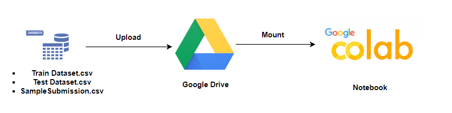
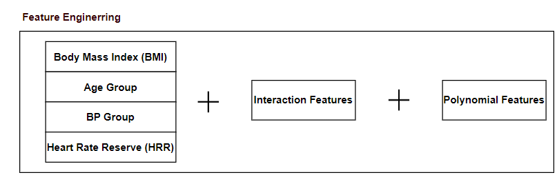
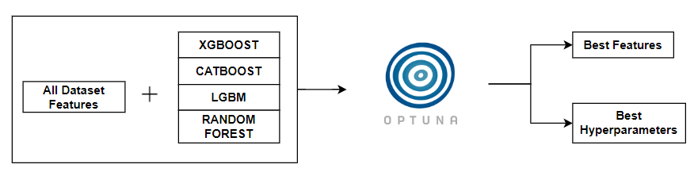
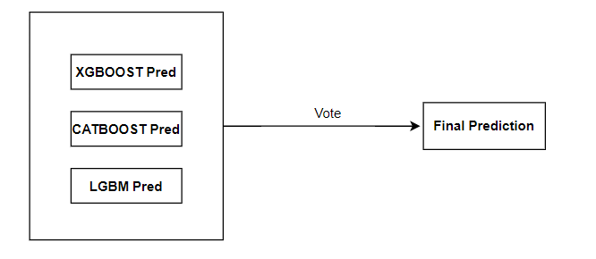

## DSN 2024 BOOTCAMP QUALIFICATION HACKATHON PROJECT

 

## PROBLEM STATEMENT

> A `heart attack (Cardiovascular diseases)` occurs when the flow of blood to the heart muscle suddenly becomes blocked. From WHO statistics every year `17.9 million` dying from heart attack. The medical study says that human life style is the main reason behind this heart problem. Apart from this there are many key factors which warns that the person may/maynot getting chance of heart attack.

 

> The challenge at hand revolves around the creation of a `predictive model` aimed at determining the likelihood of an individual having heart disease. As one of the leading causes of global mortality, detecting heart disease in its early stages is pivotal for enhancing patient outcomes and halting its progression. The conventional diagnostic methods often come with substantial costs and time requirements. Thus, there exists a pressing need for a cutting-edge predictive model that can evaluate the risk of heart disease utilizing easily accessible patient information.

> The `objective` of this challenge is to design and build a predictive model capable of accurately determining the probability of an individual having heart disease.

## Table of Contents

- [Environment setup and Packages Installation](#setup)
- [Libraries, Configurations and Utilities](#libraries)
- [Exploratory Data Analysis (EDA)](#EDA)
- [Feature Engineering](#feature-engineering)
- [Hyperparameter Tuning and Feature Selection](#hyperparameter-tuning-and-feature-selection)
- [Model Ensembling](#ensembling)

## Installation

If you wish to run the code locally, follow these steps:

1. Clone the repository: `git clone https://github.com/Sodiq179/DSN-2024-Bootcamp-Qualification-Hackathon`.
2. Upload `DSN_2024_Bootcamp_Qualification_Hackathon_Solution_(Sodiq_Babawale).ipynb` on google colab.
3. Run the codes.

## Environment setup and Packages Installation

 

## Feature Engineering

 

## Hyperparameter Tuning and Feature Selection

 

## Model Ensembling

 

## Technologies Used

- **Google Drive:**
- **Google colab:** 
- **Pandas, NumPy:** 
- **Scikit-learn:** 
- **xgboost, catboost, lightgbm:** 

## Support

For any issues, suggestions, or queries, contact the maintainers at [babawalesodiq996@gmail.com].
